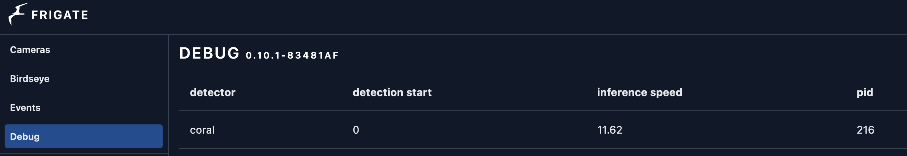

# Frigate NVR installation on Jetson Nano 4GB with Google Coral Dual Edge TPU (AI Object Detection)

1. Download all files to  `/home/nano/frigate` and navigate to the folder.

2. The Jetson Nano 4GB doesn't come preinstalled with docker compose. Installing docker compose on the Jetson Nano can be annoying, I've compiled a script to speed things up:  `prepnano.sh` (you might need to replace the download link in the `prepnano.sh` file with the newest `docker-compose-linux-aarch64` link): 

    https://github.com/docker/compose/releases

    Give execute permissions and launch:
    ```bash
    sudo chmod +x prepnano.sh && sh prepnano.sh
    ```

    `prepnano.sh` should install Curl, Nano and Docker Compose (which were not provided with the Jetson SDK I am running)

3. Adjust volumes in the `frigate.yml` file for your setup:
    ```bash       
    - /home/nano/frigate/config.yml:/config/config.yml:ro
    - /PATH/TO/YOUR_FOLDER:/media/frigate
    ```

4. Update the following in `config.yml`:
    *  MQTT `username`, `password`, `IP` and `port`. (this assumes you have an MQTT server running. I recommend [Mosquitto](https://mosquitto.org/))
    * Storage preferences (under `record`)
    * Detector preferences (under `detectors`)
    * Camera `username`, `password`, `IP` and `port`
    * Camera size (`detect` `width` and `height`)
    * Items to track (`person`, `dog`, etc.)


5. Append this to the root crontab:
    ```bash
    @reboot docker compose -f /home/nano/frigate/frigate.yml up -d
    ```
6. Reboot Jetson Nano
    ```bash
    sudo reboot
    ```

7. Test that Frigate is running with `sudo docker ps`. You should get output like: 

```bash
CONTAINER ID   IMAGE                                    COMMAND                  CREATED             STATUS         PORTS                                                                                  NAMES
1234567891   blakeblackshear/frigate:stable-aarch64   "/init python3 -u -m…"   About an hour ago   Up 3 minutes   0.0.0.0:1935->1935/tcp, :::1935->1935/tcp, 0.0.0.0:5000->5000/tcp, :::5000->5000/tcp   frigate
```

8. Navigate to Frigate in browser: `http://replace_this_with_frigate_ip:5000/`

9. **BONUS: Object Detection With Google Coral**:
    
    **ONLY PROCEED BEYOND THIS POINT IF YOU INTEND TO USE THE GOOGLE CORAL** 

    Ensure everything is working (with the CPU) prior to this point (with a single camera - anything more will overload the poor Nano's CPU). 
    
   I was able to get the [Google Coral](https://coral.ai/products/m2-accelerator-dual-edgetpu/) working by using the the following guide:

    https://coral.ai/docs/m2/get-started/#3-install-the-pycoral-library

10. The Jetson Nano has a power managment feature (ASPM) enabled by default for the M.2 slot, which places it into low-power mode periodically. This low-power mode DOES cause a compatibility issue with the Google Coral board. You can [disable this](https://github.com/google-coral/edgetpu/issues/96#issuecomment-616566015) by appending  `pcie_aspm=off` to the APPEND line in the `extlinux.conf` thusly (back up `extlinux.conf` first):

    ```bash
    nano /boot/extlinux/extlinux.conf
    ```

    Find the line that says:

    ```bash
        APPEND ${cbootargs} quiet root=/dev/mmcblk0p1 rw rootwait rootfstype=ext4 console$
    ```

    And change it to this:

    ```bash
    APPEND ${cbootargs} quiet root=/dev/mmcblk0p1 rw rootwait rootfstype=ext4 console$ pcie_aspm=off
    ```

11. Update your `config.yml` file by uncommenting and adjusting the following:
    ```yml
    detectors:
    coral:
        type: edgetpu
        device: pci
    ```
12. Update your `frigate.yml` by uncommenting the following line:

    ```yml
          - /dev/apex_0:/dev/apex_0 # passes a PCIe Coral, follow driver instructions here https://coral.ai/docs/m2/get-started/#2a-on-linux

    ```
    Reboot your device. 

13. Check that Frigate is detecting & using the Google Coral by navigating to the following in your Frigate page:

    

    Theoretically, Frigate shouldn't have even launched if it hasn't detected the Google Coral board. If you see the above image and it's showing an inference speed with a random decimal point, it's likely you have it configure correctly.